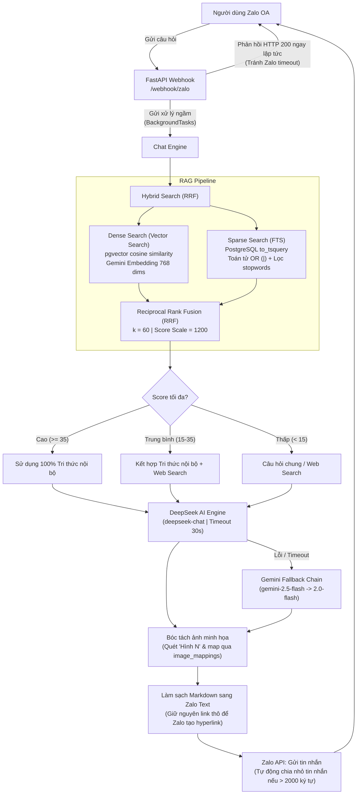

# 🤖 Dự Án Chuyên Viên Ảo - Khối Đảng
> **Hồ sơ kiến trúc & Hướng dẫn kỹ thuật hệ thống (Production Release 2026)**
>
> Tài liệu này cung cấp cái nhìn toàn diện, sâu sắc nhất về kiến trúc hệ thống, sơ đồ nghiệp vụ, thiết kế cơ sở dữ liệu và quy trình vận hành của dự án Chuyên Viên Ảo. Dành cho các lập trình viên, kiến trúc sư hệ thống và cán bộ quản trị.

---

## 📌 1. Giới Thiệu Chung & Mục Tiêu Dự Án
Dự án **Chuyên Viên Ảo - Khối Đảng** là một giải pháp chuyển đổi số toàn diện áp dụng Trí tuệ Nhân tạo (AI) và Tìm kiếm ngữ nghĩa (RAG) vào công tác hành chính cấp cơ sở tại Đảng ủy xã. Dự án giải quyết hai bài toán cốt lõi:

1.  **Soạn thảo Công văn giao việc tự động**: Nhận văn bản chỉ đạo của cấp trên (ảnh chụp, PDF), tự động OCR, phân tích nội dung, tự động phân vai giao việc cho 5 cơ quan cấp xã (UBND, UBKT, Ban Xây dựng Đảng, MTTQ, Văn phòng Đảng ủy) và điền thông tin vào mẫu Word `.docx` chuẩn Khối Đảng.
2.  **Trợ lý Q&A Nghiệp vụ & ĐHTN**: Cung cấp chatbot thông minh qua ứng dụng **Zalo Official Account (Zalo OA)** giúp cán bộ, đảng viên tra cứu các tài liệu hướng dẫn sử dụng phần mềm Điều hành tác nghiệp (ĐHTN), Thủ tục hành chính Đảng (TTHC) và quy trình nghiệp vụ với câu trả lời chính xác kèm hình ảnh minh họa thao tác thực tế.

---

## 📁 2. Cấu Trúc Mã Nguồn & Thư Mục Dự Án

```text
Chuyên viên ảo/
│
├── taovanban_khoidang/              # LÕI NGHIỆP VỤ SOẠN THẢO VĂN BẢN
│   ├── references/                  # Tài liệu mẫu & Tri thức nền cứng
│   │   ├── cong_van_giao_viec_mau.docx  # Mẫu công văn chuẩn Khối Đảng (chứa các thẻ biến {{...}})
│   │   ├── kienthuc_dhtn.md         # Bộ kiến thức nghiệp vụ ĐHTN gốc (tri thức nền cứng)
│   │   └── TTHC/                    # Thư mục chứa tài liệu TTHC Đảng gốc (.docx, .pdf)
│   ├── output/                      # Thư mục lưu trữ công văn Word sinh ra & Ảnh minh họa trích xuất
│   │   └── images/                  # Nơi lưu trữ ảnh chụp màn hình bóc tách từ tài liệu HDSD
│   └── SKILL.md                     # Tài liệu mô tả quy tắc nghiệp vụ chi tiết & phân vai giao việc
│
├── services/                        # MODULE DỊCH VỤ HỆ THỐNG
│   ├── ai_engine.py                 # Cổng kết nối AI (DeepSeek primary, Gemini fallback)
│   ├── rag_pipeline.py              # Xử lý RAG (Semantic Chunking, Batch Embedding, Hybrid Search)
│   ├── knowledge_manager.py         # Quản lý tài liệu (parse PDF/DOCX/SRT, trích xuất ảnh, re-index)
│   ├── audit_logger.py              # Ghi logs giám sát hoạt động hệ thống (audit logs)
│   ├── document_creator.py          # Bóc tách ảnh, sinh file Word theo template
│   └── zalo_api.py                  # Tương tác Zalo OA (gửi tin nhắn, chia tin nhắn dài, clean Markdown)
│
├── routers/                         # CỔNG KẾT NỐI API (FASTAPI ROUTERS)
│   ├── webhook.py                   # Webhook Zalo OA (nhận ảnh, file, text, điều phối ngầm)
│   └── admin.py                     # Quản trị web (Dashboard, CRUD tài liệu, lịch sử chat, audit logs)
│
├── templates/                       # Giao diện Jinja2 cho Admin Dashboard
│   ├── base.html, login.html        # Giao diện đăng nhập
│   ├── dashboard.html, settings.html# Giao diện tổng quan & Cấu hình AI
│   └── documents.html, audit_logs.html # Quản lý tài liệu, giám sát hoạt động
│
├── scripts/                         # KỊCH BẢN TIỆN ÍCH
│   ├── seed_knowledge.py            # Nạp tri thức tiếng Việt mặc định ban đầu
│   └── reindex_embeddings.py        # Re-index thay đổi kích thước vector & tạo index HNSW
│
├── docker/
│   └── init.sql                     # Script khởi tạo cơ sở dữ liệu (tự động bật pgvector)
│
├── database.py                      # Module kết nối cơ sở dữ liệu (PostgreSQL / SQLite local fallback)
├── models.py                        # Định nghĩa ORM Models (Documents, Chunks, Sessions, Messages, Logs)
├── main.py                          # Ứng dụng FastAPI chính: Webhook, Static Image, Secure Downloader
├── Dockerfile                       # File đóng gói container ứng dụng chính
├── docker-compose.yml               # File Docker Compose quản lý 3 containers (App, DB, Caddy SSL)
└── Caddyfile                        # Tự động cấu hình SSL HTTPS Let's Encrypt & reverse proxy
```

---

## 🧠 3. Kiến Trúc RAG & Chat Engine Hoạt Động Bất Đồng Bộ

Hệ thống ứng dụng kiến trúc RAG cấp độ Production kết hợp tìm kiếm lai (Hybrid Search) và xếp hạng bằng Reciprocal Rank Fusion (RRF) để đảm bảo độ chính xác tối đa.

### Sơ đồ luồng xử lý tin nhắn Q&A:



### 💡 Các cải tiến RAG nổi bật:
*   **Matryoshka Representation (768 chiều)**: Mặc định `gemini-embedding-2` sinh vector 3072 chiều. Chúng ta cấu hình giảm chiều (dimensionality reduction) xuống **768 chiều** thông qua tham số `output_dimensionality` của Google AI SDK. Việc này giúp **giảm 4x bộ nhớ**, **tương thích với giới hạn 2000 chiều của PostgreSQL indexes (HNSW, IVFFlat)** mà vẫn giữ nguyên **98%+ chất lượng ngữ nghĩa**.
*   **FTS OR Logic cải tiến**: Module tự động lọc các stop-words tiếng Việt (như *"hướng dẫn", "chi tiết", "làm thế nào"*...) và nối các từ khóa còn lại bằng toán tử `OR` (`|`). Giúp tăng tỷ lệ recall và đảm bảo RAG vẫn hoạt động tốt bằng từ khóa ngay cả khi API Key sinh Vector bị lỗi/chết.
*   **RRF Scale**: Điểm số RRF gốc tối đa là `1/61 + 1/61 = 0.03278`. Hệ thống nhân với hệ số **1200** để kéo dãn thang điểm về dạng `0 - 40` điểm, tương thích trực tiếp với các ngưỡng phân loại (MEDIUM=15, HIGH=35) trên giao diện giám sát admin.

---

## 📄 4. Sơ Đồ Nghiệp Vụ Soạn Thảo Văn Bản Khối Đảng

Quy trình tự động hóa chuyển đổi văn bản chỉ đạo của cấp trên thành Công văn giao việc xã:

```mermaid
seqdiagram
    actor Admin as Quản trị viên (Zalo/Web)
    participant Bot as Webhook / Web App
    participant OCR as Gemini Vision OCR
    participant AI as DeepSeek Analyser
    participant Word as Word Document Creator
    
    Admin->>Bot: Gửi ảnh chụp/PDF văn bản cấp trên
    Note over Bot: Nhận diện Admin ID Zalo hợp lệ
    Bot->>OCR: Trích xuất nội dung văn bản & Định dạng cấu trúc
    OCR-->>Bot: Trả về văn bản thô + JSON thông tin pháp lý
    Bot->>AI: Phân tích nhiệm vụ và phân vai giao việc
    Note over AI: Căn cứ vào từ khóa nghiệp vụ của 5 cơ quan xã<br/>để giao đúng vai chủ trì và thời hạn
    AI-->>Bot: Trả về phân vai giao việc (JSON)
    Bot->>Word: Nạp mẫu cong_van_giao_viec_mau.docx
    Note over Word: Áp dụng Quy tắc gộp nhiệm vụ đặc thù (Ban Xây dựng Đảng)<br/>và Quy tắc kính gửi tối giản (chỉ gửi đơn vị được giao việc)
    Word->>Word: Điền thông tin vào các thẻ biến {{...}}
    Word-->>Bot: Trả về file Word (.docx) & lưu vào thư mục output
    Bot->>Bot: Tạo FileMapping bảo mật (UUID 50 ký tự) & Ghi Audit Log
    Bot-->>Admin: Gửi link tải bảo mật (ví dụ: /download/file_uuid)
```

---

## 🗄️ 5. Thiết Kế Cơ Sở Dữ Liệu (Database Schema)

Cơ sở dữ liệu hỗ trợ đồng thời hai chế độ: **PostgreSQL + pgvector** (Production) và **SQLite** (Local Development Fallback). Hệ thống gồm 9 bảng chính:

```mermaid
erDiagram
    documents ||--o{ knowledge_chunks : "chứa"
    documents ||--o{ document_versions : "có lịch sử"
    documents ||--o{ image_mappings : "chứa ảnh"
    chat_sessions ||--o{ chat_messages : "gồm"
    
    documents {
        int id PK
        string title
        string source UNIQUE
        string category "core, updatable, personal"
        string file_type "pdf, docx, srt, txt"
        text raw_text
        int current_version
        int chunk_count
        boolean is_active
        string created_by
        datetime created_at
        datetime updated_at
    }

    document_versions {
        int id PK
        int document_id FK
        int version
        text raw_text
        text change_summary
        string changed_by
        datetime created_at
    }

    knowledge_chunks {
        int id PK
        int document_id FK
        int chunk_index
        text text
        vector embedding "768 dimensions"
        json chunk_metadata "heading, page..."
        datetime created_at
    }

    image_mappings {
        int id PK
        int document_id FK
        string hinh_key "Hình 1, Hình 2..."
        string img_rel_path
        datetime created_at
    }

    chat_sessions {
        int id PK
        string platform "zalo, telegram, web"
        string external_chat_id INDEX
        string user_display_name
        int message_count
        datetime last_activity
        datetime created_at
    }

    chat_messages {
        bigint id PK
        int session_id FK
        string role "user, assistant"
        text content
        string ai_model_used
        float rag_score
        json rag_sources
        int response_time_ms
        datetime created_at
    }

    audit_logs {
        bigint id PK
        string entity_type "document, chat, system"
        int entity_id
        string action "CREATE, UPDATE, DELETE, CHAT"
        string actor
        json details
        string ip_address
        datetime created_at
    }

    admin_users {
        int id PK
        string username UNIQUE
        string password_hash
        string display_name
        boolean is_active
        datetime last_login
        datetime created_at
    }

    file_mappings {
        int id PK
        string file_id UNIQUE "UUID bảo mật"
        string filename
        datetime created_at
    }
```

### ⚡ Cấu hình Database Indexes tối ưu trên Production:
Nhằm tối ưu hóa hiệu năng truy vấn cho hàng ngàn tài liệu:
1.  **GIN Index (`idx_chunks_text_fts`)**: Hỗ trợ PostgreSQL Full-Text Search nhanh hơn 30x:
    `CREATE INDEX idx_chunks_text_fts ON knowledge_chunks USING gin (to_tsvector('simple', text));`
2.  **B-tree Index (`idx_chunks_document_id`)**: Tối ưu hóa các truy vấn JOIN giữa bảng tài liệu và chunks.
3.  **B-tree Index (`idx_documents_is_active`)**: Hỗ trợ lọc nhanh các tài liệu đang active trong RAG.
4.  **B-tree Index (`idx_audit_logs_created`)**: Tăng tốc tải nhật ký giám sát xếp hạng theo thời gian thực trên admin dashboard.

---

## 🔒 6. Cơ Chế Giám Sát & Nhật Ký Thay Đổi Tri Thức (Audit Log)

Để đảm bảo tính minh bạch và có khả năng truy vết (traceability) mọi hoạt động thay đổi tri thức:
*   Mỗi hành động của admin (Tải file mới, Bật/Tắt tài liệu, Xóa tài liệu, Cập nhật phiên bản) đều được ghi nhận vào bảng `audit_logs` dưới dạng **Append-only** (không thể sửa/xóa qua giao diện).
*   Giao diện Admin Dashboard cung cấp màn hình **Nhật ký giám sát (Audit Log)** chi tiết đến từng IP, tài khoản thực hiện, thời gian và nội dung thay đổi chi tiết trước/sau dưới dạng JSON.
*   **Lịch sử phiên bản (`document_versions`)**: Khi một tài liệu được cập nhật nội dung mới, hệ thống tự động lưu lại phiên bản cũ, ghi nhận lý do thay đổi và người thay đổi. Admin có thể tra cứu và khôi phục lại bất kỳ lúc nào.

---

## 🖥️ 7. Giao Diện Admin Dashboard Web

Giao diện quản trị được xây dựng trên nền **FastAPI + Jinja2 + Vanilla CSS** cao cấp, hỗ trợ thiết kế Responsive, Sleek Dark Mode và Glassmorphism hiện đại:

*   **Trang đăng nhập (`/admin/login`)**: Đăng nhập bằng tài khoản Quản trị viên (mặc định: `admin` / `admin123`).
*   **Trang tổng quan (`/admin/dashboard`)**: Hiển thị các chỉ số thống kê (tổng tài liệu, chunks, số phiên chat, số tin nhắn lỗi), lịch sử chat gần đây và nhật ký hệ thống.
*   **Trang quản lý tri thức (`/admin/documents`)**: Danh sách tài liệu, cho phép tải lên file mới (`.pdf`, `.docx`, `.srt`, `.txt`, `.md`), xóa tài liệu hoặc bật/tắt kích hoạt tài liệu trong RAG.
*   **Chi tiết tài liệu (`/admin/documents/{id}`)**: Xem nội dung chi tiết, các chunks được phân cắt, danh sách ảnh minh họa bóc tách được và lịch sử các phiên bản.
*   **Lịch sử chat (`/admin/chats`)**: Giám sát các cuộc hội thoại của cán bộ qua Zalo, hiển thị rõ điểm số RAG tương ứng của từng câu hỏi và mô hình AI đã phản hồi.

---

## 🚀 8. Hướng Dẫn Cài Đặt & Triển Khai Production (Docker)

Hệ thống được đóng gói trọn gói bằng Docker Compose, triển khai an toàn sau proxy Caddy tự động cấu hình SSL HTTPS.

### 📋 Yêu cầu chuẩn bị trên VPS:
- VPS chạy hệ điều hành Ubuntu 22.04 LTS hoặc CentOS 7+.
- Đã cài đặt Docker và Docker Compose v2.
- Tên miền đã trỏ bản ghi DNS A về IP của VPS (Ví dụ: `bot.conghaiso.vn` trỏ về IP `45.119.82.227`).

### ⚙️ Bước 1: Tạo tệp cấu hình môi trường `.env`
Tạo file `.env` tại thư mục gốc của dự án trên VPS:
```env
# Database Credentials
DATABASE_URL=postgresql://chatbot_user:chatbot_password_secure_2026@db:5432/chatbot_db

# AI API Keys
GEMINI_API_KEY=AIzaSy...
DEEPSEEK_API_KEY=sk-...

# Bot Configuration
AI_PRIMARY_ENGINE=deepseek
DEEPSEEK_TIMEOUT=30
ZALO_API_TOKEN=your_zalo_token_here
ZALO_MODE=webhook
SERVER_DOMAIN=https://bot.conghaiso.vn

# Admin Settings
ADMIN_ZALO_IDS=12345678901234,98765432109876
ADMIN_USERNAME=admin
ADMIN_PASSWORD=admin123
SESSION_SECRET_KEY=rag-chatbot-secret-key-change-me-2026
```

### 🚀 Bước 2: Khởi động hệ thống
Chạy lệnh Docker Compose để build và khởi chạy 3 container:
```bash
docker compose up --build -d
```
Caddy sẽ tự động kết nối đến Let's Encrypt để đăng ký và gia hạn chứng chỉ SSL HTTPS miễn phí cho tên miền `bot.conghaiso.vn`, sau đó định tuyến an toàn vào cổng 8080 của container `chatbot-web`.

### 🔀 Bước 3: Di trú và Nạp tri thức ban đầu
Để nạp tri thức nghiệp vụ mặc định ban đầu vào database, chạy lệnh:
```bash
docker exec -it chatbot-web python scripts/seed_knowledge.py
```
Để re-embed hoặc tái tạo index vector 768 chiều khi cần thiết, chạy lệnh:
```bash
docker exec -it chatbot-web python scripts/reindex_embeddings.py
```

---

## 🛠️ 9. Hướng Dẫn Bảo Trì & Xử Lý Sự Cố Thường Gặp

### 1. Xem nhật ký log của hệ thống
Xem log ứng dụng web theo thời gian thực:
```bash
docker logs -f chatbot-web --tail 100
```
Xem log của Caddy Web Server (nếu gặp lỗi SSL hoặc định tuyến):
```bash
docker logs -f chatbot-caddy --tail 100
```

### 2. Sửa lỗi Zalo OA bị chặn gửi tin nhắn (Zalo token hết hạn)
Zalo OA Token cần được làm mới định kỳ. Nếu bot không phản hồi và log báo lỗi token (`401 Unauthorized` hoặc `error_code: -124`), hãy copy token mới từ Zalo Developer portal, cập nhật biến `ZALO_API_TOKEN` trong `.env` và restart lại container:
```bash
docker compose up -d
```

### 3. Sự cố Gemini API bị Rate Limit (Lỗi 429)
*   **Hiện tượng:** Log báo `429 RESOURCE_EXHAUSTED` khi tạo embedding hoặc Q&A.
*   **Nguyên nhân:** Do sử dụng API Key Free Tier vượt quá giới hạn 1,000 requests/ngày.
*   **Khắc phục:** Đổi key mới trong `.env` và chạy lại script `reindex_embeddings.py` để cập nhật các chunks bị lỗi. Hệ thống có cơ chế FTS fallback nên vẫn trả lời được bằng từ khóa trong thời gian key bị khóa.
