# Kế hoạch triển khai nâng cấp GraphRAG (LightRAG) với DeepSeek (Phiên bản Sản xuất Cải tiến)

Bản kế hoạch này cập nhật và hoàn thiện thiết kế kỹ thuật dựa trên các nguyên tắc tối ưu hóa hiệu năng, xử lý bất đồng bộ I/O, định tuyến thông minh (Smart Routing), chống quá tải API (Rate Limits), và quản lý dữ liệu đầu vào.

---

## 1. Thiết kế Kiến trúc Hệ thống Cải tiến

Kiến trúc mới đảm bảo tính ổn định tối đa dưới tải lớn:

```mermaid
flowchart TD
    subgraph "Luồng Nạp Tri Thức (Agent Ingestion)"
        A["Tài liệu gốc (PostgreSQL)"] --> B["Ingestion Agent (Queue & Checkpoint JSON)"]
        B -->|"1. Đọc Metadata & Tiền xử lý"| C["Prepended Metadata Text"]
        C -->|"2. Gọi API bất đồng bộ (aiohttp)"| D["lightrag_service.py"]
        D -->|"Trích xuất & Tự động Retry (Tenacity)"| E[("Đồ thị tri thức (Graph DB/Files)")]
    end

    subgraph "Luồng Hỏi Đáp (Smart Routing)"
        F["Câu hỏi Zalo OA"] --> G["LLM Router (Gemini Flash - Siêu nhanh)"]
        G -->|"Chi tiết (LOCAL)"| H["Hybrid Search cũ (pgvector + FTS)"]
        G -->|"Tổng hợp (GLOBAL)"| I["LightRAG Global Search"]
        H & I --> J["AI Engine (DeepSeek / Gemini Fallback)"]
        J --> K["Zalo API: Phản hồi kết quả"]
    end
```



---

## 2. Chi tiết kỹ thuật & Đoạn mã triển khai cụ thể

### 2.1. Quản lý thư viện bổ sung
Cập nhật requirements.txt:
```text
lightrag-hku>=1.0.0
networkx>=3.0
aiohttp>=3.9.0
tenacity>=8.3.0
```

---

### 2.2. Service lõi GraphRAG chống nghẽn I/O & Rate Limit
#### [NEW] services/lightrag_service.py
Dịch vụ này sử dụng `aiohttp` để gọi API bất đồng bộ hoàn toàn và `tenacity` để tự động Retry có giãn cách (Exponential Backoff) nhằm phòng tránh Rate Limit (HTTP 429).

```python
import os
import asyncio
import aiohttp
from tenacity import retry, stop_after_attempt, wait_random_exponential, retry_if_exception_type
from lightrag import LightRAG, QueryParam
import config
from services.rag_pipeline import get_embeddings_batch

class LightRAGManager:
    def __init__(self):
        self.working_dir = config.GRAPHRAG_DIR
        
        # Khởi tạo LightRAG với custom async LLM & Embedding functions
        self.rag = LightRAG(
            working_dir=self.working_dir,
            llm_model_func=self.deepseek_llm_complete,
            embedding_func=self.gemini_embedding_func
        )

    @retry(
        retry=retry_if_exception_type(Exception),
        stop=stop_after_attempt(5),
        wait=wait_random_exponential(min=2, max=30),
        reraise=True
    )
    async def deepseek_llm_complete(self, prompt, system_prompt=None, history=None, **kwargs) -> str:
        """Gọi DeepSeek API bất đồng bộ hoàn toàn bằng aiohttp với cơ chế Retry tự động"""
        url = config.DEEPSEEK_API_URL
        headers = {
            "Content-Type": "application/json",
            "Authorization": f"Bearer {config.DEEPSEEK_API_KEY}"
        }
        
        messages = []
        if system_prompt:
            messages.append({"role": "system", "content": system_prompt})
        if history:
            for h in history:
                messages.append({"role": h.get("role", "user"), "content": h.get("content", "")})
        messages.append({"role": "user", "content": prompt})

        payload = {
            "model": config.DEEPSEEK_MODEL,
            "messages": messages,
            "temperature": kwargs.get("temperature", 0.2),
            "max_tokens": kwargs.get("max_tokens", 2048)
        }
        
        async with aiohttp.ClientSession() as session:
            async with session.post(url, json=payload, headers=headers, timeout=90) as response:
                if response.status == 200:
                    data = await response.json()
                    return data["choices"][0]["message"]["content"]
                else:
                    error_text = await response.text()
                    raise Exception(f"DeepSeek Error: HTTP {response.status} - {error_text}")

    async def gemini_embedding_func(self, texts: list[str]) -> list[list[float]]:
        """Nhúng vector bất đồng bộ thông qua executor để tận dụng thư viện gemini SDK hiện có"""
        loop = asyncio.get_event_loop()
        return await loop.run_in_executor(None, get_embeddings_batch, texts)

    def insert_text(self, text_content: str):
        """Đẩy nội dung thô vào Đồ thị tri thức"""
        if not text_content.strip():
            return
        self.rag.insert(text_content)

    def query(self, query_str: str, mode: str = None) -> str:
        """Truy vấn đồ thị tri thức (Chạy đồng bộ)"""
        mode = mode or config.GRAPHRAG_DEFAULT_MODE
        return self.rag.query(query_str, param=QueryParam(mode=mode))

# Khởi tạo instance toàn cục dùng chung cho cả project
graphrag_client = LightRAGManager()
```

---

### 2.3. Trình định tuyến thông minh (LLM Router)
Trong file services/chat_engine.py, chúng ta thay thế việc kiểm tra từ khóa bằng một LLM Router siêu nhẹ sử dụng Gemini API (hoặc DeepSeek) với prompt tối giản để phân loại trong vòng dưới 300ms.

```python
import config
from google import genai
from google.genai import types

def route_query(user_question: str) -> str:
    """
    Sử dụng Gemini Flash (mô hình nhanh, rẻ) để phân loại câu hỏi.
    Returns: 'LOCAL' hoặc 'GLOBAL'
    """
    if not config.GEMINI_API_KEY:
        # Fallback khi mất API Key
        return "LOCAL"

    router_prompt = f"""Bạn là bộ định tuyến câu hỏi (Query Router) của hệ thống RAG Khối Đảng.
Nhiệm vụ của bạn là phân loại câu hỏi của người dùng thành 2 nhóm duy nhất:
1. 'LOCAL': Dành cho câu hỏi tra cứu quy định cụ thể, tìm kiếm chi tiết một thủ tục hoặc tính năng phần mềm.
   Ví dụ: "Cách tải báo cáo trên ĐHTN?", "Quy trình kết nạp đảng viên mới?", "Văn phòng Đảng ủy làm gì?".
2. 'GLOBAL': Dành cho câu hỏi tổng hợp, phân tích xu hướng, so sánh, tóm tắt chủ đề lớn xuyên suốt nhiều văn bản.
   Ví dụ: "Tổng hợp các lỗi phổ biến của các phòng ban", "Các văn bản chỉ đạo của Tỉnh ủy năm 2026 có những điểm chung nào?", "So sánh vai trò của UBND và UBKT".

Chỉ trả về đúng một từ duy nhất: "LOCAL" hoặc "GLOBAL" (Không giải thích gì thêm).

Câu hỏi cần phân loại: "{user_question}"
Phân loại:"""

    try:
        client = genai.Client(api_key=config.GEMINI_API_KEY)
        response = client.models.generate_content(
            model="gemini-2.5-flash",
            contents=router_prompt,
            config=types.GenerateContentConfig(
                temperature=0.0,
                max_output_tokens=5
            )
        )
        result = response.text.strip().upper()
        if "GLOBAL" in result:
            return "GLOBAL"
        return "LOCAL"
    except Exception as e:
        print(f"[Router Error] Lỗi phân loại câu hỏi: {e}. Fallback về LOCAL.")
        return "LOCAL"
```

---

### 2.4. Agent nạp dữ liệu tuần tự có Checkpoint & Prepended Metadata
#### [NEW] scripts/rebuild_graph.py
Script này đóng vai trò là Ingestion Agent chạy tuần tự, tiền xử lý ghép siêu dữ liệu (Metadata Prepend), lưu checkpoint vào file JSON để đảm bảo khả năng tiếp tục khi gặp sự cố, và trì hoãn (sleep) để chống quá tải Rate Limit.

```python
import os
import sys
import json
import time
import asyncio
# Thêm root dự án vào sys.path
sys.path.append(os.path.dirname(os.path.dirname(os.path.abspath(__file__))))

import config
from database import get_db_session
from models import Document
from services.lightrag_service import graphrag_client

CHECKPOINT_FILE = os.path.join(config.GRAPHRAG_DIR, "ingestion_checkpoint.json")

def load_checkpoint() -> set:
    """Đọc danh sách ID tài liệu đã được nạp thành công từ file JSON"""
    if os.path.exists(CHECKPOINT_FILE):
        try:
            with open(CHECKPOINT_FILE, 'r', encoding='utf-8') as f:
                data = json.load(f)
                return set(data.get("processed_ids", []))
        except Exception as e:
            print(f"[Checkpoint] Không thể đọc checkpoint: {e}. Bắt đầu mới.")
    return set()

def save_checkpoint(processed_ids: set):
    """Lưu danh sách ID đã hoàn thành vào file JSON"""
    try:
        with open(CHECKPOINT_FILE, 'w', encoding='utf-8') as f:
            json.dump({"processed_ids": list(processed_ids)}, f, ensure_ascii=False, indent=4)
    except Exception as e:
        print(f"[Checkpoint] Không thể lưu checkpoint: {e}")

async def run_sequential_ingestion():
    print("=== [AGENT] BẮT ĐẦU NẠP TRI THỨC TUẦN TỰ (COLD START) ===")
    
    processed_ids = load_checkpoint()
    print(f"[Checkpoint] Đã nạp thành công {len(processed_ids)} tài liệu trước đó.")

    db = next(get_db_session())
    try:
        # Lấy danh sách tài liệu đang kích hoạt
        documents = db.query(Document).filter(
            Document.is_active == True,
            Document.status == 'active'
        ).order_by(Document.id.asc()).all()
        
        pending_docs = [doc for doc in documents if doc.id not in processed_ids]
        print(f"[Queue] Có {len(pending_docs)} tài liệu mới cần xử lý.")

        for i, doc in enumerate(pending_docs):
            print(f"\n[{i+1}/{len(pending_docs)}] Đang xử lý ID {doc.id}: '{doc.title}'")
            
            # 1. Chuẩn hóa siêu dữ liệu và Ghép vào đầu văn bản (Metadata Prepend)
            metadata_header = (
                f"TÀI LIỆU TRI THỨC HÀNH CHÍNH KHỐI ĐẢNG\n"
                f"- Tiêu đề: {doc.title}\n"
                f"- Số hiệu/Nguồn: {doc.source}\n"
                f"- Thể loại văn bản: {doc.document_type or 'Chưa phân loại'}\n"
                f"- Cơ quan ban hành: {doc.issuer or 'Chưa xác định'}\n"
                f"- Lĩnh vực nghiệp vụ: {doc.domain or 'Chung'}\n"
                f"- Ngày ban hành/Hiệu lực: {doc.effective_date or 'N/A'}\n"
                f"--------------------------------------------------\n"
                f"NỘI DUNG TÀI LIỆU:\n"
            )
            raw_content = doc.raw_text or ""
            payload = metadata_header + raw_content

            if not raw_content.strip():
                print(f"[Skipped] Tài liệu ID {doc.id} không có nội dung văn bản.")
                processed_ids.add(doc.id)
                save_checkpoint(processed_ids)
                continue

            # 2. Đẩy sang LightRAG xử lý bất đồng bộ
            try:
                # Chạy insert đồng bộ từ thư viện
                graphrag_client.insert_text(payload)
                print(f"[Success] Đồng bộ ID {doc.id} vào Đồ thị tri thức thành công.")
                
                # Cập nhật checkpoint ngay lập tức
                processed_ids.add(doc.id)
                save_checkpoint(processed_ids)
                
                # Nghỉ 2-3 giây để tránh Rate Limit API của DeepSeek
                time.sleep(2.5)
            except Exception as e:
                print(f"[Error] Không thể nạp tài liệu ID {doc.id}: {e}")
                print("[Pause] Dừng Agent để kiểm tra hệ thống. Checkpoint đã được lưu an toàn.")
                break

        print("\n=== [AGENT] QUÁ TRÌNH NẠP HOÀN TẤT HOẶC TẠM DỪNG ===")
    finally:
        db.close()

if __name__ == "__main__":
    asyncio.run(run_sequential_ingestion())
```

---

## 3. Kế hoạch xác thực và giảm thiểu rủi ro (Risk Mitigation & Verification)

### Kịch bản kiểm thử (Verification Steps)
1. **Kiểm tra luồng I/O không chặn (Non-blocking FastAPI):**
   * Sử dụng công cụ benchmark hoặc gửi đồng thời 10 câu hỏi dạng `GLOBAL` tới API FastAPI của Chatbot. Xác minh qua logs xem luồng Webhook Zalo có bị chậm trễ hay phát sinh lỗi nghẽn không.
2. **Kiểm tra độ chính xác của LLM Router:**
   * Viết testcase nhỏ với 20 câu hỏi thử nghiệm để đo độ chính xác của Gemini Flash Router. Mục tiêu đạt tỉ lệ phân loại đúng trên 90%.
3. **Kiểm tra tính an toàn của Checkpoint khi mất mạng:**
   * Chạy `scripts/rebuild_graph.py`, ngắt kết nối mạng giữa chừng, kiểm tra xem file `ingestion_checkpoint.json` đã lưu lại đúng ID tài liệu gần nhất chưa. Bật lại mạng và chạy lại script để xác nhận việc tiếp tục nạp nối tiếp mà không cần nạp lại từ đầu.
